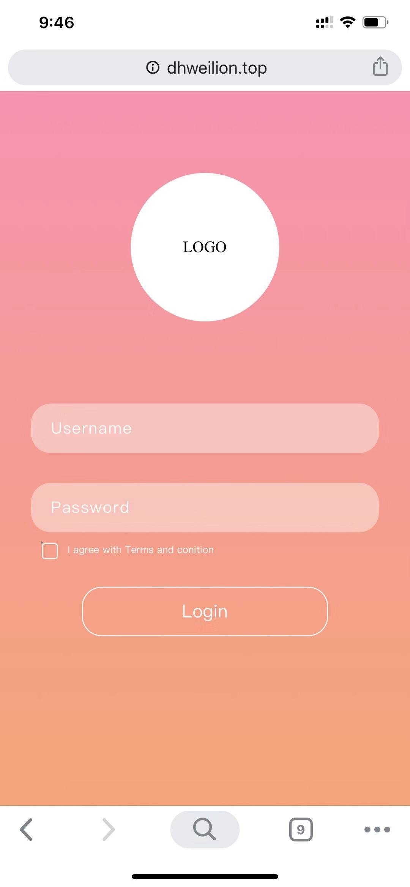
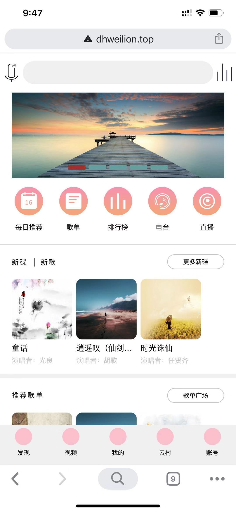
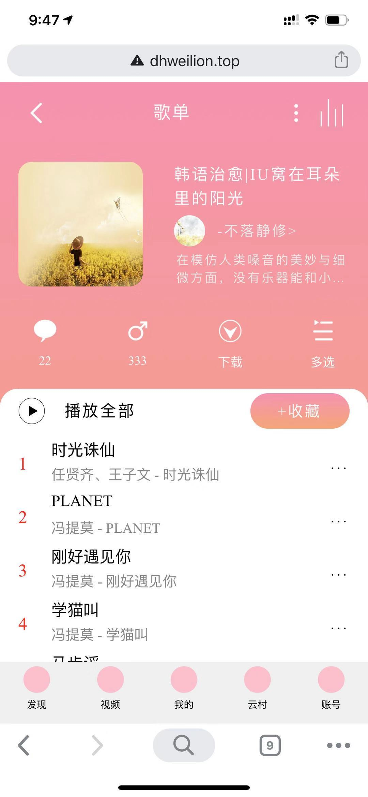
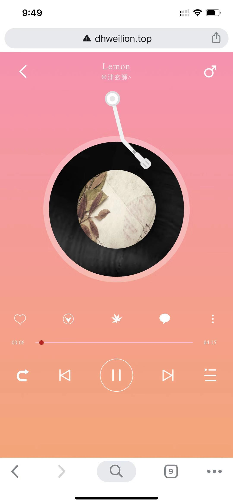
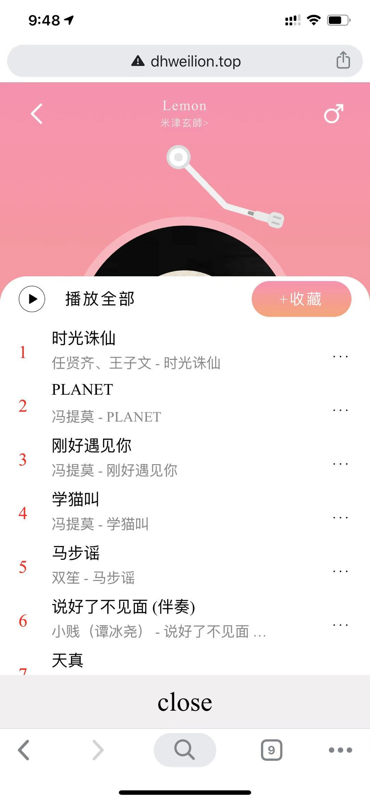

# musicplayer

## Project setup
```
npm install
```

### Compiles and hot-reloads for development
```
npm run serve
```

### Compiles and minifies for production
```
npm run build
```

### Run your tests
```
npm run test
```

### Lints and fixes files
```
npm run lint
```

### Run your unit tests
```
npm run test:unit
```

### Customize configuration
See [Configuration Reference](https://cli.vuejs.org/config/).

###  Website
See [here](http://www.dhweilion.top/)

### Product show
1. login page
    
2. Find page
    
3. Music list page
    
4. Player dialog
    
5. Player dialog with the song list dialog
    
